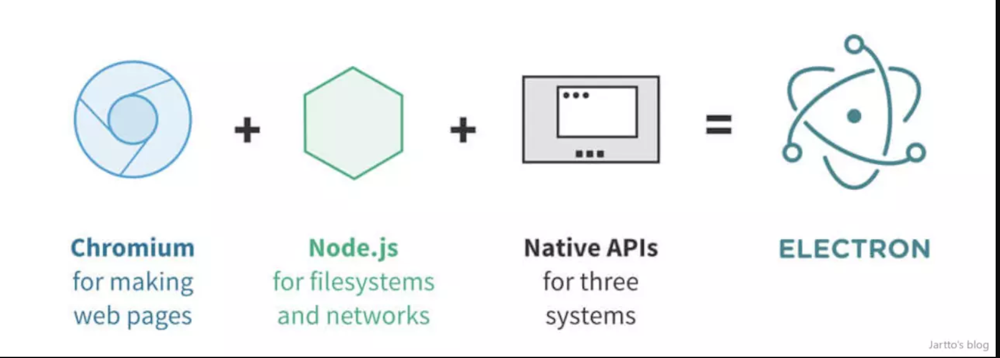

### 简介
electron是一个用Html、css、JavaScript来构建桌面应用程序的开源库，可以打包为Mac、Windows、Linux系统下的应用
### 基于electron实现的软件
> * vscode (帮助->切换到开发者工具)
> * atom(开发工具)
> * slack(协作工具)

### 运行原理
Electron 结合了 Chromium、Node.js 和用于调用操作系统本地功能的API

### 从一个HelloWorld开始
1. npm init
2. npm install --save electron
3. electron -v 查看版本
4. 创建入口文件 index.js
5. 创建展示页面 index.html
4. electron . 启动

###主进程与渲染进程

### app BrowserWindow

### Notification
#### 1. 使用HTML5-API
在渲染进程中使用,但没有广泛支持,win7支持,win8不支持,win10不支持
###  2. 在主进程中使用Notification模块
window10版本17134.765不支持
### 3. Notification的创建必须在ready周期触发之后

     

 